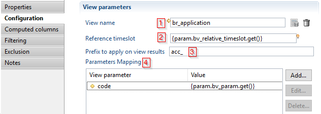
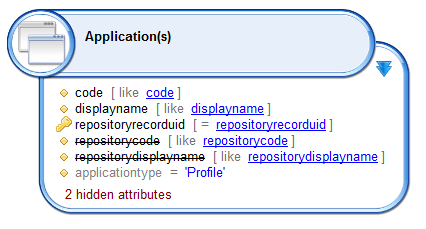
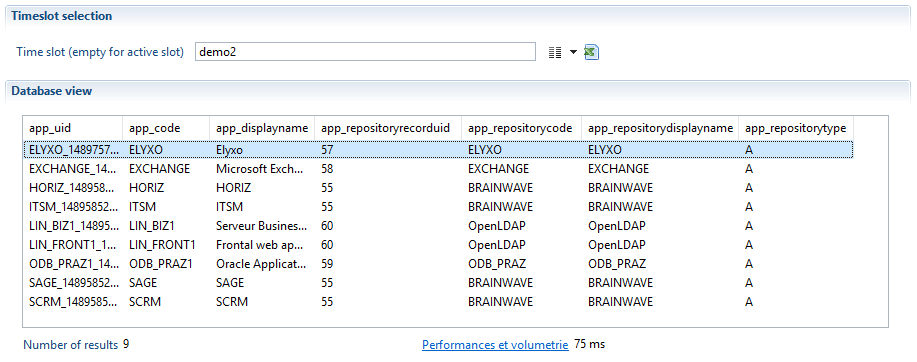

# Components

## Common Operations

For more information on the common operators implemented in all components, please refer the the following documentation: [Common operators](business-view-features)

## Source Components

The source component provides the initial data to the other filter components. It is always placed in top of the business view. Only one source component is allowed per business view. There are two types of source component.

- View source (ledger, log or business)
- JavaScript source

### View

#### Objective

The initial data provided to the source component is based on data queried by another view. All types of views are allowed

- Ledger views
- Log views
- Business views


#### Specific Configuration



1. It is mandatory to select a view from the view picker, any of type of view is allowed (Ledger view, log view or business view)
2. If the `Reference timeslot` is empty the component will automatically execute the view in the same timeslot as the Business View, it is possible to overload the timeslot by providing a timeslot uid or a relative value according to the timeslot of the Business View , for example if the Business View is executed in the previous timeslot(current - 1), and the `Reference timeslot` contain the value `-1`, then the source view component executes the view in the timeslot(current - 2)
3. A prefix can be specified. The prefix will be added to all the attributes of the view  
4. In this section you can configure parameters that will be given to the view.

#### Examples

In the flowing example we will show a sample business View that contain only a view source component, it will be based on `br_application` (standard brainwave view)

Here is the definition of the `br_application` ledger view:



The image below show the result of `br_application` executed on the timeslot named "demo2":  


The business view definition contains only one component (view source component)  


Illustration of the configuration:

- In this example no reference timeslot is provided, it means that the timeslot given to the business view will be used (demo2)
- A prefix `app_` is configured to apply on results
- No parameters given to `br_application`
- "Computed columns, Filtering and Exclusion" sections are left empty  


Business View execution results :  



We can observe that the two results (`br_applications`, sample BusinessView) are the same, because no filter if configured, the source view component has executed `br_application` on "demo2" timeslot, the only difference is the prefix, in the Business View  results we can see that all columns name are prefixed by `app_`.

### Script

#### Objective

The script source is used to generate records or read records from a source other than the Ledger database or the Log database. For example, a script source may connect to a WebService, read a file or generate static datasets.  

#### Specific Configuration

Through the creation wizard, a JavaScript file is attached to the business view file. All the components using scripts will share this file. Like any other script component in the product, the script is event driven. There are 3 events corresponding to the state of the business view engine :  

| Event                    | Comment                                                                                 |  
| :----------------------- | :-------------------------------------------------------------------------------------- |
| init                     | the init event is triggered when the script source should initialize itself. It is called when the business engine is initializing. This event should be used to allocate resources or prepare data before the execution of the business view starts|  
| read                     | the read event is triggered each time the business engine requests the next record from the source. This event will be called repeatedly until the script returns null meaning "no more record available"|
| dispose                  | the dispose event is triggered when the script should free resources allocated during the init or the read events.|

The script component parameters are the name of the function found in the JavaScript file for each event. The following snapshot shows the corresponding Properties tab :  


Clicking on the link of one of the event name lets you enter a function name. The body of the function is then added at the end of the JavaScript file.  
Clicking on the yellow arrow located at the upper left of the field jumps to the function declaration in the JavaScript file.  
Clicking on the light bulb located at the upper right of the field lets you choose an already declared function in the JavaScript file.  

When using JavaScript it is highly recommended to fill out the Attribute tab. This tab is used to provide information concerning the schema, _i.e._ the attributes generated by JavaScript, to the business view engine (see caption below). When configuring or using a report or a page it is necessary to access the list of attributes returned by the business view. When using JavaScript it is necessary to declare the generated attributes as the product is not capable of automatically generating them:  


As in other modules of the product it is possible to directly call a Java library. To use classes from a third-party jar, the jar file(s) should be placed in the folder `/library/jars` of the project. The full package path must also be declared in the code when allocating object. For example :

```javascript
var /*String*/ myObject = new com.acme.coffeeproject.PrepareCoffee();
```

In the script you have access to a predefined global object called `dataset`. This contains all the input parameters for the business view. If a parameter contains an expression
(_e.g._`{config.myVar.toUpperCase()}`), the value is already resolved and ready to use in the `dataset` object.  

#### Examples

In this example, a CSV file is opened and each line is returned as a record:  

```javascript  
var /*FileParser*/ csvParser = null;
var /*Array*/ header = null;

function init() {
    // create a CSV parser
    csvParser = businessview.getFileParser("CSV");
    csvParser.separator = ';';
    csvParser.textseparator = '"';
    csvParser.encoding = 'UTF-8';
    // read file specified in the business view input parameter csvFileName
    csvParser.open(dataset.csvFileName.get());
    // read header
    header = csvParser.readHeader();
}

function read() {
    var /*Array*/ line = csvParser.readLine();
    // check if no more record from CSV
    if (line == null) {
        return null;
    }
    // convert the CSV record into a DataSet
    var /*DataSet*/ record = new DataSet();
    for (var i = 0; i < line.length; i++) {
        var /*String*/ attrName = header[i];
        var /*String*/ attrValue = line[i];
        // all values are String except the 'logincount' column
        var /*String*/ type = (attrName == 'logincount') ? 'Number' : 'String';
        var /*Attribute<String>*/ attribute = record.add(attrName, type, false);
        attribute.set(attrValue);
    }
    return record;
}

function dispose() {
    // close the parser if it exist
    if (csvParser != null) {
        csvParser.close();
    }
}
```

The init function creates a CSV file parser on a file given as an input parameter of the business view. The header is read once.

The read function reads the next CSV line and return null if no more record is available in the file. Otherwise, all the values of the line are copied into a DataSet which is returned to the business view engine.

The dispose function closes the file. Note that even if an error occurs in the read function, the dispose function is called to allow freeing resources.  
