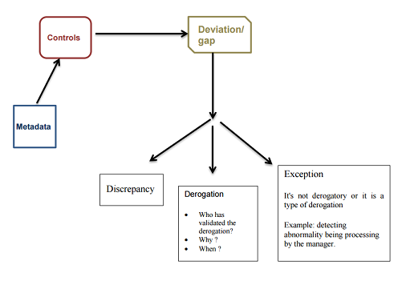
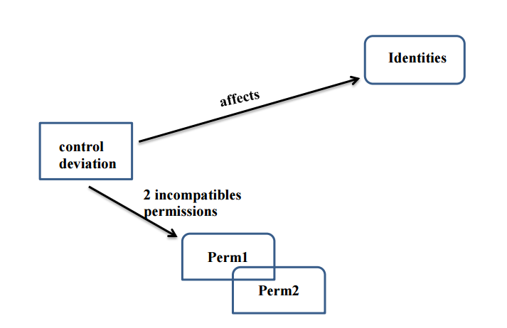

# Theoretical Rights and Segregation of Duties

## Context

This document functionally describes the different types of controls provided with iGRC. The technical functionalities are described in the following article available [Control Methods present in Analytics](control-methods.md)

Brainwave Identity GRC incorporates the concept of control. Controls are of several types including:

- Segregation of Duties (SoD controls). This is the principle of verification of the incompatibility between two tasks or activities.
- Jurisdictional control based on permission in relation to an organizational unit, or depending on the characteristics of a person. This type of control can be defined as the verification of the implementation of a business rule or a security policy. In other words, a control = a rule +context + a semantic.

A control allows identifying such problems:

- data Quality; _e.g._ identification of orphan accounts,
- the principle of least privilege, typically on the allocation of rights,
- the separation of tasks also known as Segregation of Duties (SoD) to characterize tasks as being incompatibles between them or carrying a risk if they are performed by the same person.

## iGRC Analytics Types of Controls

Among the defined controls under the mentioned article: [Control Methods present in Analytics](control-methods.md), and depending on the type of parameter, such results can be obtained:

- Arbitrary set: The control result is the result of a rule. It is useful in the case of data quality issues. Examples of concepts of the iGRC ledger that can be titled by a control discrepancy are account, identity, etc.; setting such type of control comes to implement a rule of type:
  - list of the orphan, dormant accounts,
  - list of identities without HR code (employee identification)
- Ensemblist approach: Those are perimeter controls at the application level through the type of control like "Assigning permission". This type of control informs on people who likely have the permission in exhaustive manner. Thus, the management rules of authorizations allocation being implemented within a company can be automated.

_Example:_ Only the people of the department "My Department" have the rights to access to permission "α" of the application "β". Therefore, it is necessary to define a rule that reference identities and fill in the parameter on the department: "My_department". "α" and "β" parameters can be user-entered information.

In addition of returning the discrepancies, control can also check:

- The over-allocations rights: Persons or accounts that are not entitled to have the right on permissions but have them.
- The sub-allocations rights: Persons or accounts that should have the rights to permission and do not have them.

This control on assigning permission can show multiple results as mentioned above. This control is different from the control of the arbitrary set that references a single type of result.

## Segregation of Duties Controls

The SoD type of control identifies incompatible tasks between them. It is configurable through the separation of tasks,the separating of two sets of tasks. A task is a set of couples permission / application. There is one type of SoD control result: "the inconsistencies". The SoD controls are based on accounts or identifiers. It is also possible to perform inter-application SoD.
Example, being Accountant (Task 1) is incompatible with the payer function (Task 2).

Brainwave iGRC analytics includes a "SoD target" for creating SoD controls. The controls are automatically generated in the subdirectory "controls / generated" of the associated project during the data loading process.

## Theoretical Rights Controls

This can be access request verification via an authorization management system. For example, some rights can be awarded to some users and not to others. Such controls can then compare the actually granted authorizations to those granted through a workflow process for example.

Configuring a theoretical right control involves specifying the perimeter on which this control is applied, both in terms of population (identities) and permissions covered by associated applications. The control will thereby compare on the given perimeter the actually granted permissions to the "theoretical" ones in order to highlight the results lists. The technical documentation on configuring the theoretical rights controls into iGRC Analytics is available [here](../theoretical-rights/theoretical-rights.md)

### theoretical rights types

1. An access request workflow with a beneficiary ID, a couple of applications/ permissions.

2. The description of the tasks by perimeters: such loading can be done in two steps. The conditions for granting application/permission is loaded during the first data loading process (cf. collector line under the theoretical right target). There may be several applications / permissions couples on which the theoretical rights will be built. Then, once the table of theoretical rights loaded, loading the reconciliation of theoretical rights can be done: it is the research of the targeted population on which are based the granting conditions :

- Verification of theoretical access workflows. The over and under right-allocations can be displayed using the information such as the list of identities, applications/permissions as well as the theoretical rights.
  - However, in the access request workflow we do not have the information which permits to verify the sub-allocations of rights.
  - When performing a control, the results are recorded in the iGRC ledger. Within the meaning of the database, controls results are stored in an object called "control result".

- "Root cause (Impacts)": It identifies for a given permission, the accounts or identities deviation regarding a control.
Example: Is there's orphan accounts that have rights to applications =\> iGRC automatically calculates the impact in terms of permissions attached to an orphan account.

Remark: It is not only to characterize the deviation/inconsistency but also the results to be used for reporting purposes. For SoD and theoretical right types of controls, it is necessary to fill-in these attributes (required) in order to use them into a report.

- Control code : Control identifier
- Control type: Control family on which the work is done: from 1 to 6. "Control result = 6" for SoD and "control result = 5" for the theoretical rights.
- It provides information on the type of result that is over-allocation ("Control result type = 1") or "under/sub-allocation rights ("Control result type = 2 ").
- Control entity takes a value of "string" type that provides information on the family of objects that the control refers: accounts or identities.
- This type of control can identify people who have legitimate access to a given permission.
- This type of control allows automating the audit of management rules of granting authorizations being in place within the company.
