# Advanced Configuration

## Dashboard Parameters

A dashboard may have one or more parameters to modify its content (data and titles).
Any parameter will be displayed in the **dashboard parameters panel,** where the end-user can select or type values and click **Apply** to update the dashboard with new parameter values.

The example below displays simple HR statistics dashboard for a given organization within the enterprise ( count of personel in the organizaton, and jobs breakdown).
The end-user can then select an organization from a list of known organization to update the dashboard with data about the selected organization.


A dashboard can have two kinds of parameters

- **User editable parameters** : These are the regular parameters. the value of these parameters can be changed by the end-user. These parameters can affect dashboard component data and titles.
- **Hidden parameters** : The value of these parameters must be set at design time only. The parameter value can also be part of the dashboard title. Hidden parameters are mostly useful with **Dashboard Templates**. (see section below).  

### User Editable Parameters

**User editable parameters**   are the common type of dashboard parameters.
They are defined by the designer and their values can be changed by the end-user through the dashboard parameter panel.
The value of each parameter can be used to modify dashboard components data and/or title.

The parameter value can either be typed in a text box, or selected from a list of possible values, by the end user.
The possible values can either be dynamic and come from a view, or static list of values.
The designer can also define a default text or item to be used when the dashboard is displayed for the first time.

### Hidden Parameters

The common purpose of **hidden parameters** is to allow creating separate instances of a **dashboard template** (read more on dashboard templates in the section below).
These dashboard instances can then be published to different populations.
For example, consider there are many account respositories (domain forest) managers in your company, which all need a similar dashboard with analytics for the accounts in the repository they manage.
In this case, the designer would create a dashboard template that displays account analytics for a given repository, as a hidden parameter.
He will then create instances of the dashboard template for each managed repository, and publish them to each repository manager.
For convenience, the dashboard title could automatically include the repository name, _e.g._ "Access Analytics on EMEA".

Hidden parameters have the same behavior as regular parameters, with the following differences:

- A hidden parameter does not show in the dashboard parameter panel. Its value must be set at design time, usually when instanciating the dashboard from a template.
- The hidden parameter value can affect dashboard component data and title plus it can also be used in the dashboard's title itself.

### Create a Dashboard Parameter

Dashboard parameters are managed via the **Parameters** tab of the dashboard's configuration wizard.  


The designer can do the following:

- create a new parameter
- modify an existing parameter
- Delete a parameter
- Move up and down a parameters to change their display order in the dashboard parameter panel (from left to right)

To create a new parameter

- Click **Create New**... to display the parameter creation dialog box  


- Type in **Name**  a unique name for the parameter. This name is used to identify the parameter in component titles.  
Use a meaningful but short name , such as **org**. Don't use anonymous names such as param1. Parameters names should not contain space.  
- Type in **Label** a label for the parameter. This label will be displayed a title for the parameter in the dashboard's parameter panel.
- Optionally type in **Help text** a text describing the purpose of the parameter. this text will show as a tooltip for the parameter in the dashboard's parameter panel.
- Check **Editable by end-user**  for regular user editable parameters and uncheck for hidden parameter
- Select a user interface type for editing the parameter:
  - **Text box** : the parameter value will be typed in a text box
    - Optionally type in **Default Value** a default value for the parameter.
  - **Menu** : the parameter value can be selected from a list.
- For Menu-based parameters, select the type of values that will be displayed in the menu
  - **Dynamic values** to display dynamic values coming from a view
  - **Static values** to display a static list of values

For **Dynamic values** menus:

- Select the **Source View** that will provide items for the parameter menu.  
The view must have " **Allow selection of the view in the portal**" option to be listed as a source view.  
- If the view has parameters, click **Params...** to edit the parameters of the view.

- Select in **Value column** a column from the selected view that will provide the value of the parameter.
This value will usually be used to modify data in the dashboard, It could be for exemple an organization permanent UID or code.
- Select in **Label column**  a column from the selected view that will provide the label of the parameter value to be displayed in the parameter panel.
The parameter label can also be included component titles.
- Check the **Allow empty value** option to allow a null value to be selected for this parameter.
    You can type an optional label for this empty value, for example "_All Organisations_". The actual meaning and behavior for this null value is up to you.
    If this option is not checked, the first value in the list is automatically selected in the displayed mashup dashboard parameter panel.
- Optionally , select a **Default value** for the parameter, to be used when the dashboard is displayed for the first time.  

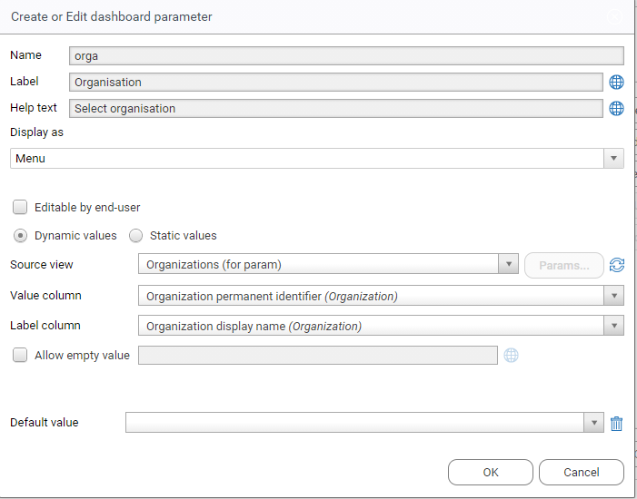

> It's recommanded to use dedicated views to provide values for parameter menus, with only the columns that are used for values and labels.
This is to ensure optimal performance when displaying the dashboard parameter panel with large datasets (_e.g._ listing accounts).  
Don't use general purpose views with dozens of columns.
>
> Whenever possible, you should use permanent, timeslot-independant, and environment independant key attributes as value columns for parameters, to ensure maximum portability of the dashboard across timeslots and environments.
This is especially important for hidden parameters and for parameter default values, because the value is stored with the dashboard and must be valid across timeslots and across environements (UAT, Production).

For **static values** menus:

- Click **Create** to add a new static value of the list. You must then provide a **Label** and a **Value** for each item in the list.
  - The label will be displayed in the UI dashboard parameter panel and in component titles.
  - The value will be passed as parameters to dashboard data.
- You can **Create** , **Edit** , **Delete** or **Delete All** menu items
- Optionally , select a **Default value**  for the parameter, to be used when the dashboard is displayed for the first time.


### Use Parameters in a Pashboard

Parameter values can used to modify dashboard components data and titles and, only for hidden parameters, the dashboard title itself.

To modify a dashboard component data based on the value of a parameter, do the following:

- Open the component's **Configuration** wizard
- Select the **Search** or **Value** tab of the component's configuration
- In simple free search mode:
  - define the search criteria
  - when select a value for a given criterion, check the **Dashboard parameter** option, the value menu will now display the list of dashboard parameters
    - select the dashboard parameter to use
    

- In advanced rule mode:
  - Make sure that search **rule**  has at least a parameter
  - Click the **Parameters** button to configure the rule parameters
  - For the rule parameter that should use the dashboard parameter, select **Dashboard Parameter** as the source
  - Select the dashboard parameter to use from the parameter list ( the parameter's label and name are displayed is the list)

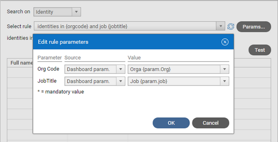

You can also use dashboard parameters in a table or chart component to filter secondary attributes.

To include a dashboard parameter's label in a dashboard's component title, do the following:

- Open the component's **Configuration** wizard
- Select the **Basic** tab  of the component's configuration
- Click In the **Title** text box, and move the insertion bar where the parameter label should be placed inside the title
- Select a parameter from the **Insert Variable** list (both user-editable and hidden parameters are listed) ; the parameter will be inserted as **{param.xxxx}** token.
- You could also directly type the parameter token in the title box  

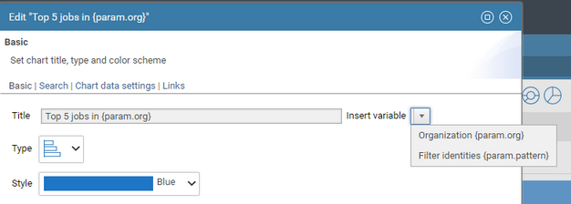

To include a hidden parameter label in a dashboard's title, do the following:

- Open the dashboard's **Configuration** wizard
- Select the **General**  tab  
- Click In the **Title**  text box, and move the insertion bar where the hidden parameter label should be placed inside the title
- Select a parameter from the **Insert Variable**  list (only hidden parameters are listed) ; the parameter will be inserted in the title as **{param.xxxx}** token.
- The actual value of the hidden parameter can be set in the **Instance** tab (see. § Dashboard Template section)
- Click **Finish** to validate your configuration
- Notice how the dashboard title (and the corresponding menu entry) have changed.  

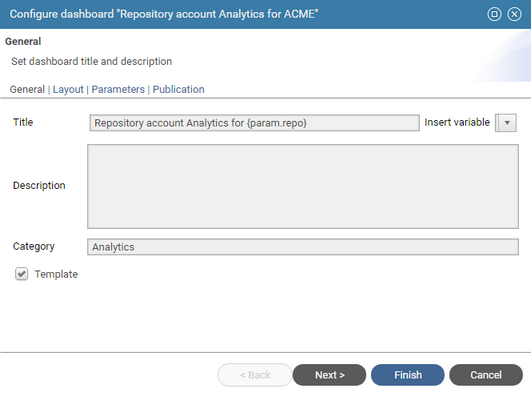

### Cascading Parameters

New in **Curie R1**

Cascading parameters are useful when selecting a value from items that are hierarchically organized, for example `Application > Permission`, `Repository > Account`, etc...

Cascading parameters means that the list of values proposed for a parameter depends on the selected value from another parameter.

To define cascading parameters, do the following:

- Define the parent parameter, for exemple `app (Applications)`
- Define the child parameter, for example `perm (Permission)`
  - select **Dynamic values** for the source
  - select the **Source View** which must accept a parameter that points to the parent parameter selection value (_e.g._ application permanent identifier).
  If the view does not exist, create it and refresh the list of views using the refresh icon.
  - click the **Params** button, select the parameter of the view and set its source to **Dashboard param.**
  - select the parent parameter (in this case,  `Application {param.app}` ) from the value list.


This is how the dashboard parameter panel will look like:


## Dashboard Templates

The main purpose of **Dashboard Templates**  is to streamline the creation of similar dashboard that only differ from their scopes.

Consider the above example, where there are many account respositories, one per area, each being managed by a different team. The managers all need a similar dashboard with analytics for the accounts in the repository they manage. The scope of the dashboard in the repository.
In this case, a designer would create a **dashboard template** that display access analytics for a given repository, as a hidden parameter.
He will then **instanciate** the dashboard template for each of the managed repositories, and publish them to each repository manager.
For convenience, the dashboard title could automatically include the repository name, _e.g._ "Access Analytics on EMEA" .

To create a dashboard template or to turn a dashboard into a template, do the following :

- Open the dashboard's configuration wizard
- In the **General** tab, check the **Template** option  
- In the **Parameters** tab, create one or more hidden parameters, with the option "**Editable by end-users**" unchecked, which will serve as the dashboard's scope parameters.
- In the **General** tab again, you can optionally include the parameter's labels in the dashboard title (see section **Hidden Parameters** above)

To create an instance of a dashboard template, do the following:

- In the **Dashboard Manager** page,
- Select the dashboard template to instanciate,
- Click the **Instanciate...** button, this opens the dashboard instanciation wizard
- In the **Instance** tab, Select or type a value for each of the dashboard's hidden parameters.
- Click **Finish** to create the dashboard instance
- The new dashboard instance appears in the list of dashboard
- The dashboard can be published as is to its target audience, or modified before publication
- The dashboard instance parameters can be modified at any time, through the **Instance** tab of the dashboard configuration.
- You can create as many dashboard instances of the same template as needed.


The dashboard instances can then be published as is to their respective audience, or be modified before publication.
After creation, the new instance dashboards are independant of their template, and further changes to the template (or even deletion) won't be reflected in the dashboard instances.

## Secondary Parameter Configuration

**Secondary Parameters** may be involved in different places in a dashboard's configuration:

- **Component Rule with parameters** : Dashboard component (table, chart, gauge) Search Rule that may have parameters,
- **Component View with parameters** : Dashboard component (table, chart) View that may have parameters,
- **Dashboard Parameter Menu View with parameters** : Dashboard parameter possible values coming from a View that may have parameters,
- **Component Link Target with parameters**  : Dashboard component (chart, table or gauge) link to another page or dashboard that may have parameters,

In all these cases, you can define for each involved secondary parameter where its actual value will come from (secondary parameter **Source**), and what the actual value will be (secondary parameter **Value**).

There are four secondary parameter source types:

- **Value** : the secondary parameter value is a predefined value that must set at design-time (typed or selected from a list of possible values)
- **Dashboard Parameter** : the secondary parameter value will be taken from one of the dashboard's main parameters runtime values
- **User** : the secondary parameter will take its value from one of the currently connected user attributes
- **Clicked Item** : the secondary parameter will take its value from the chart item or table row that was just clicked

Some source types only make sense for some secondary parameters kinds, _e.g._ Clicked Item for Table and Chart Link target parameters.
The following table shows which source types applies to which secondary parameter kinds:

| **Fixed Value** |  **Dashboard Parameter** |  **User Attribute** |  **Clicked Item Attribute** |
|-----------------|--------------------------|---------------------|-----------------------------|
|  **Component Rule w/ params** |  X |  X | X |  |
|  **Component View w/ params** |  X |  X | X |  |
|  **Dashboard Parameter Menu <br> View w/ params** |  X |  | X |  |
|  **Gauge Link Target w/ params** |  X | X | X |  |
|  **Table and Chart Link Target <br> w/ params** |  X | X | X | X |

### Fixed Value Source

The secondary parameter actual value is a fixed value that must be set at design-time.
Fixed values can be used in all situations.
This could be helpful to pass ad-hoc static values to rules, views, links etc...

To use a fixed value as a source type, do the following:

- Select **Value** as the **Source** in the **Parameters** configuration panel
- Either type the fixed value in the text box or select the value of the list of proposed values (The UI is automatically determined based on the type of the secondary parameter )

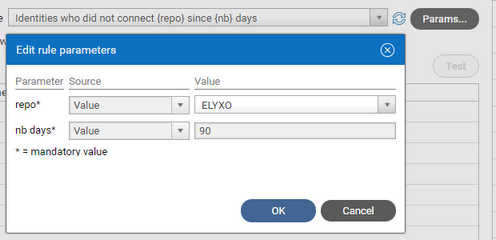

### Dashboard Parameter Source

The secondary parameter value will be passed from a given current dashboard's parameter value.
When the dashboard's end-user selects or types another value for the related dashboard parameter, and clicks **Apply**, the secondary parameter value is automatically updated.
Dashboard source types can be used with all secondary parameters, except to filter dashboard parameters themselves, so as to avoid recursion.
This source type is the principal mean to use dashboard parameters in dashboard content.
Dashboard parameters values can also be passed to other dashboard or pages through links.

To use a dashboard's parameter as a source type, do the following:

- Select **Dashboard Parameter** as the **Source** in the **Parameters** configuration panel, if the choice is available
- Select one the dashboard's parameters to use as the source. Each dashboard parameter in the list is displayed both with its label, and the syntax **{param.<param_name>}**  


### User Attributes Source

The secondary parameter will take its value from characteristics of the currently connected user.
This is especially useful to create dashboards which content automatically adapts to the current user (without the user having to select a parameter).
This source type can be used with all secondary parameter types.

To use an attribute of the current user as a source type, do the following:

- Select **User**  as the **Source** in the **Parameters** configuration panel
- Select one the user's attributes from the list.


- The proposed attributes are the columns of the **user.principal.view**  View which is configured in the project's **Configuration** > **Web Portal** > **Other Properties** section.  
The main purpose of this view is to validate the login used to connect to brainwave portal. It's also used to provide additional user-related attributes.  
You can design a view of your own to validate the login and provide custom values to use in secondary parameters (restart the server to make them effective).


#### Simulate Another User

During dashboard design, the actual values for user attributes used in secondary parameters will be those of the designer's account (which is the currently connected user at design time).  
Fortunately, you can simulate another user account while in design mode to test your dashboard. To do so:

- Select **Dashboad User Simulation...** from the dashboard's menu, to open the **Dashboard user simulation** dialog box  

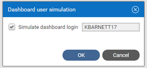

- Check **Simulate dashboard login** and type a valid login to simulate another user
- or uncheck **Simulate dashboard login** to use back the designer's account
- Click **OK** to validate the simulated account against the configured **user.principal.view**  
- When changing to another account, the dashboard parameter lists and content are updated to reflect the new user attributes.  
If not, hit F5 to refresh the dashboard and take into account the new user characteristics.
- The simulation will be effective during the designer's user session or until manually cleared. It will affect all dashboards that have secondary user paramters.  
The dashboard title indicates whether a user simulation is active.  

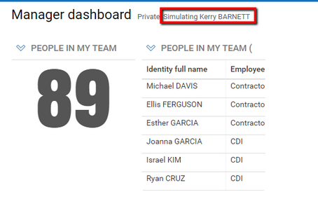

- User simulation neither affects native _View perimeter_ results nor regular pages, which are based on the actual connected user account.

### Clicked Item Attributes Source

The secondary parameter will take its value from the chart item (bar, wedge) or table row that was just clicked, when links are enabled for this widget.
This source type is only available to configure dashboard chart / table widget links and is the main mean of passing along context parameters to the link.

To use an attribute of the clicked item as a source for secondary parameters, do the following:

- Select **Clicked Item** as the **Source** in the **Links** configuration page **Parameter** area, for the target page or target dashboard.
- Select one of the clicked item attributes from the **Value** list (which are the columns of the widget's View) to pass to the secondary parameter.  


## Managing Dashboard Links

**Dashboard Links** allow to click on any dashboard widget and go to another page, dashboard, detail dialog box or even an external web site, in order to get information or carry out action on the clicked linked element.

Links are available on all dashboard widgets:

| **Widget** | **Linked item** | **Link presentation** |
|------------|-----------------|-----------------------|
|  Table |  any row of the table | Text of one of the row's columns is displayed as an html link ( blue underlined text). <br> |
|  Chart |  bar/section/wedge of the chart | The cursor will turn to a hand when moved over the bar item when links are enabled  <br> 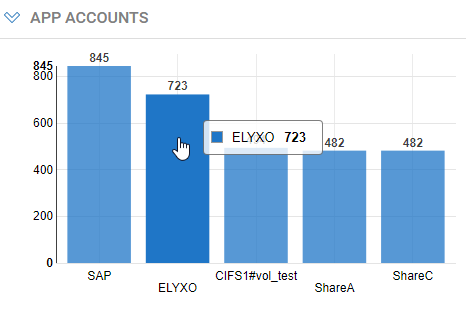|  
| Gauge | The gauge as a whole |   The cursor will turn to a hand when moved over the gauge when links are enabled  <br> |  

Links targets can be of four kinds:

- A detail page ( for example, detail on a given account, identity, group, application, etc...),
- Any given page or report page accessible to the end-user, possibly with parameters,
- Another dashboard accessible to the end-user, possibly with parameters,
- Detail dialog box,
- An external web site, possibly passing contextual parameters in the url. The linked external page will be opened on a separate browser tab.

Contextual information and information on the clicked item can be passed to the link target.

### Link configuration

To define a link on a widget do the following:

- Check **Enable links** in the configuration wizard **Links** tab to enable the links for this widget.
- Select from the **Link to**  menu the target link type, from four possibilities:
  - **Detail page** : this is the standard detail page for any given Ledger entity (such as identity, account, applicatio, group, etc...)
  - **Another page** : a custom page in the web portal, usually with parameters
  - **Another dashboard:** another dashboard, usually with parameters, that is accessible to the user.
  - **Search detail dialog box** a dialog box that displays a list of items involved in search-based gauge figure computations.
  - **External URL :** a page in another web site. Parameters are passed in the url search.
- For **table** widgets, select from **Display link in column** , the table's column where the link should be displayed.
Usually it will be the left-most column, but it could be any column of the table. Only one column can be displayed as a link.  

- Select from the **Link to** menu the type of the link target , among the four possible types: Detail Page, Another page, Another Dashboard and External URL.
- Additional link configuration will vary depending on the selected target type (see below).
- Make sure to **Save** the dashboard before testing the link and get back to view mode, because you cannot go to another page while the dashboard is being edited.

#### Detail Page Link

- Choose from the **Selected item UID attribute** menu, the view column's value to use as the permanent identifier for the detail page.
If the list is empty, you will need to add a permanent identifier to the widget's view.  
The entity type to display (_e.g._ identity, account, group) will be automatically determined from the selected column.

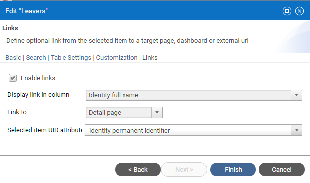

#### Another Page Link

- Select from **Target page**  menu, the target page of the link.  
Each item displays the pages's label and that page's tags within brackets, You can use both to filter the page you are targetting.
Note that all pages with a **<u>tag</u>** are listed in the menu, so you have to make sure that the selected page will actually be accessible to the end user.  
- If the page have parameters, you can define the value to use for each of its parameters:
  - **None** : to leave the page parameter empty. This is useful for non mandatory parameters, if the default value suits your need.
  - **Value:** to use a static predefined value for the parameter. Type the value to use in the text field.
  - **Clicked Item** : to use an attribute from the clicked row or chart part.  
You can select any column from the view, even it is not displayed in the widget.
Note that this choice is not available for **gauge** links, as there is no clickable sub item.
  - **Dashboard parameter** : to use a global parameter from the dashboard as a contextual value for the page parameter. Select the dashboard parameter from the list.
  - **User** : to use an attribute related to the currently connected user. Select the attribute from the list.


#### Another Dashboard Link

- Select from **Target dashboard** menu, the target dashboard of the link. Type to filter by the label of the dashboard.
Note that all dashboards are listed in the menu, so you have to make sure that the selected dashboard will actually be accessible to the end user.
- If the dashboard have parameters (either editable or hidden), you can define the value to use for each of its parameters:
  - **None** : to leave the dashboard parameter empty. This is useful for non mandatory parameters, if the default value suits your need.
  - **Value:**  to use a static predefined value for the parameter. Type the value to use in the text field.
  - **Clicked Item** : to use an attribute from the clicked row or chart part.  
You can select any column from the view, even it is not displayed in the widget.  
Note that this choice is not available for **gauge** links, as there is no clickable sub item.
  - **Dashboard parameter** : to use a global parameter from the dashboard as a contextual value for the target dashboard parameter.
Select the dashboard parameter from the list.
  - **User** : to use an attribute related to the currently connected user. Select the attribute from the list.
  

#### Search Detail Dialog Box

New in **Curie R1**

This link is only available for **gauge** widgets and only when the value aggregation function is set to `Count`. It will display the list of items involved in the search count as a table in a dialog box.  

You can further specify the columns to be displayed in the table, depending on the counted entity type (account, etc...)

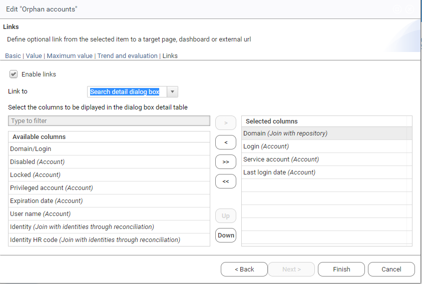

When clicking the gauge figure, a dialog box appears that lists the items in the count as a table with the selected columns. In this simple case, a list of 328 orphan accounts.  

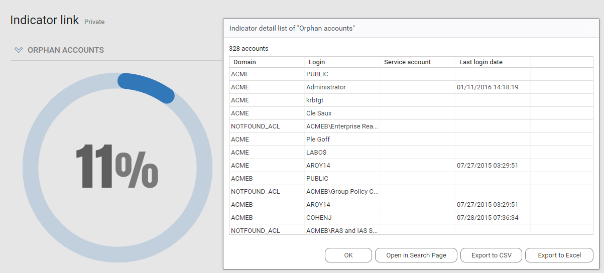

From this dialog box, you can:

- Export this list as a CSV or Excel file
- Open the search page for the counted entity (_e.g._ accounts) with the search criteria already set to match the gauge search, so that it will display the same list and give access to all the search analytics. In the case above, the search page is opened on orphan accounts, and displays the same 328 items.

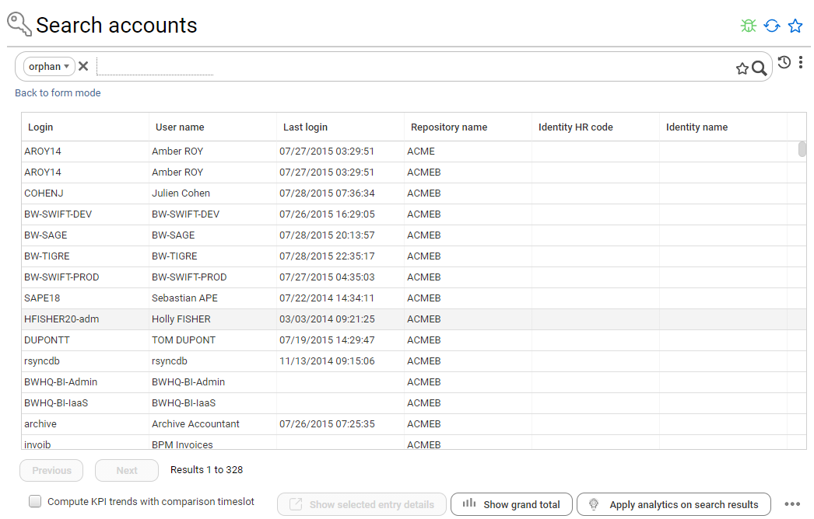

#### External Link

- Type in **Link URL** a valid url for the link. The URL must start with http:// or https// . It can contain dynamic placeholders.
- Select from **Insert variable**  menu a variable in the URL text. All valid variables are listed, and grouped in two categories: **Clicked Item attributes** and **Mashup parameters**. The actual variable values will be url-encoded in the url text (_e.g._ space => %20)  

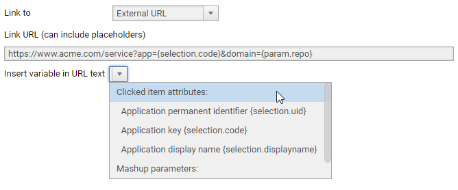

Example of actual url :


## Configure Dashboard Rsources

Dashboards **resources** are **layouts** , **chart styles** and **indicator styles**.
Dashboard resources are defined in `.dashres`  files that are stored in the project in the `webportal/resources` directory.

Two dashboard resources are provided by default:

- **default**: which defines the default layout templates, chart styles and indicator styles
- **flatcolors**: which defines additional "flat colors" indicator styles and chart styles.

Additional dashboard resources can be defined and stored in other `.dashres` files.

This is the XML structure of the `.dashres` file:

```xml
<?xml version="1.0" encoding="UTF-8" standalone="no"?>
<!DOCTYPE DashboardResourceBundle PUBLIC "-//Brainwave//DTD DashboardResourceBundle 1.0//EN" "urn:brainwave:igrc:dtds/dashres.dtd"> 
<DashboardResourceBundle name="default" displayname="Dashboards default resources">
    <layoutTemplates defaultId="1-1">
        <LayoutTemplate id="1-1" label="1 cols 100%" nbGridCols="1" nbCols="1" spans="1" />
        <LayoutTemplate id="2-1" label="2 cols 50/50%" nbGridCols="2" nbCols="2" spans="1 1" />
    </layoutTemplates>
    
    <indicatorStyles defaultId="default">
        <IndicatorStyle id="default" label="Default blue" valueColor="#1F76C7" warningColor="#ED9748" criticalColor="#FF6C6C" roundedTip="true" thickness="3" />
        <IndicatorStyle id="blueGrad" label="Blue gradient" valueColor="#008EA8 #006577" warningColor="#FFC268" criticalColor="#FF4C50" roundedTip="false" thickness="0" /> 
    </indicatorStyles> 
    
    <chartStyles defaultId="default">
        <ChartStyle id="default" label="Blue" serieColors=" #1F76C7" />
        <ChartStyle id="blueScale" label="Blue scale" serieColors="#175A97 #1F76C7 #2182DA #61A7E7 #AAD0F2" />       
    </chartStyles>   
    
</DashboardResourceBundle>
```

### Dashboard Layout Templates

Dashboard layout is based on a grid system, with a fixed number of columns of equal width and a variable number of rows, depending on the content.
Each widget in the dashboard can span over a given number of columns and rows.

A dashboard layout template defines the following characteristics of the layout:

| attribute  | meaning |
|------------|---------|
| **id**  | unique identifier for the layout |
| **label**  | the label to be displayed in the configuration wizard |
| **nbGridCols**  | the number of columns in the underlying grid |
| **nbCols**  | the number of visible columns, this is an information only field. you can use the same value as nbGridCols |
| **spans**  | the default layouting sequence of successive widgets, separated by white spaces. width and height are indicated as WxH, and 1 is a shortcut for 1x1.  Additional widgets will get the layout of the last item in the sequence |

For example, suppose you would like to define a layout template with 3 widgets on the top and a large widget at the bottom, same as below


In this case, you need a 3-columns grid template, with three widgets of 1x1 width and height on the first row plus one large widget
that spans 3 grid columns x 2 grid rows, on the next row.  
This sequence will be encoded as :  `1 1 1 3x2`

The final template definition will be:

```xml
<LayoutTemplate id="3-2" label="3 col + full" nbGridCols="3" nbCols="3" spans="1 1 1 3x2 " />
```

Note that additional widgets will inherit the layout of the last item in the template, in this case 3x2.

You can define as many templates as you like in different files.

### Indicator Styles

An indicator style allows to define the look and feel of dashboard indicator widgets, mainly the color of the indicator ring.

The attributes of an indicator style are the following:

| attribute  | meaning |
|---|---|
| **id**  | unique identifier for the style |
| **label**  | the label to be displayed in the configuration wizard |
| **valueColor** | the color of the indicator ring , this color can either a plain color in `#RRGGBB` notation, or a gradient color with two colors separated by a space. `#RRGGBB` `#RRGGBB`  |
| **warningColor**  | not yet supported. |
| **criticalColor**  | not yet supported |
| **roundedTip**  | not yet supported |
| **thickness**  | not yet supported |

The following example defines an style with a green to blue gradient ring color, from #00AA4D to #6A00F3.  

```xml
 <IndicatorStyle id="greenBlue" label="Green blue gradient" valueColor="#00AA4D #6A00F3"  /> 
```

The indicator could look as follows:

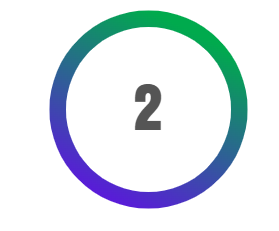

> **Note:** It is recommended to not use warm colors ( red and orange) for ring color so as not to be confused with the warning and critical threshold colors.

### Chart Styles

 An chart style allows to define the look and feel of dashboard chart styles, mainly series line and bars colors.

The attributes of a chart style style are the following:

| attribute  | meaning |
|---|---|
| **id**  | unique identifier for the style |
| **label**  | the label to be displayed in the configuration wizard |
| **serieColors** | space separated list of serie colors in `#RRGGBB` format.  If there are more series than colors, the chart will cycle through defined colors |

The following example defines an chart style with 5 serie colors

```xml
 <ChartStyle id="vivid" label="Vivid" serieColors="#01A9CD #FFB713 #F71B27 #6A6A6C #212B2C" />
```

The resulting configuration preview and chart will look as follows:

  

  

## Project-based Dashboards

There are two kinds of dashboards for different usages: **user dashboards** and **project-based dashboards**.

**User dashboards** are the regular dashboards created, modified and managed by **dashboard designers** through the web interface.
These dashboards can then be shared for use to target group of end-users.
  
User dashboards are intended to be specific to a given customer and modified by customers to fit its specific needs.  
For this reason, they are stored in the database on each customer's environment.  
User dashboards must be manually transfered between the different customer environments (_e.g._ dev, test, production) or backed-up using the export/import feature.

**Project dashboards**, on the other hand, are not specific to a customer, they address a common need and are delivered inside a facet or an app, just like pages, views and rules.  

Project dashboards are stored as `.dashboard` files inside the project in the specific `webportal/dashboards/` folder or a facet sub-folder.  

Contrary to user dashboards, project dashboards will be shared between customers that use the same app or facet and across different environments - dev , test, production - of the same customer as long as the web portal references the same project.  
Dashboard project included in the project will automatically appear in the web portal to authorized users, without having to manually import them.  

### Create a Project Dashboard

Project dashboards are created and edited by dashboard **developers**, _i.e._ users with the **developer** role.  

To create a project dashboard, a developer must do the following:

- Click on the **Create** button in the Dashboard manager. The dashboard creation wizard is displayed.
- Give first a title to the dashboard in the **Title** box
- Check the **Save to project** option (1). This option is only available if you have the new "developer" role (see below).
- A default file named is proposed, based on the dashboard title. You can change the file name (2).
- The file is stored by default in the `webportal/dashboards` folder.
You can specify a different subfolder, for example to include the dashboard in a specific facet, by clicking the folder icon (3).  
- View & edit the dashboard in the portal as for user dashboards.
- Don't share the dashboard yet if it's intended to be distributed to different customers, through a facet or an app, because the target audience is not known at development time.

Any dashboard developer can edit any project dashboard, even without being its author.


**Note:** The **designer** and **developer** roles, dedicated to dashboards, are provided in the `bw_dashboards` facet, which is included in **Identity Analytics version 1.4** add-on.

[Download Identity Analytics add-on](https://marketplace.brainwavegrc.com/package/bw_ias/)

### Working with Project Dashboards

All project dashboards in the current project are visible to developers and technical administrators in the dashboard manager, with a special "Project" type.

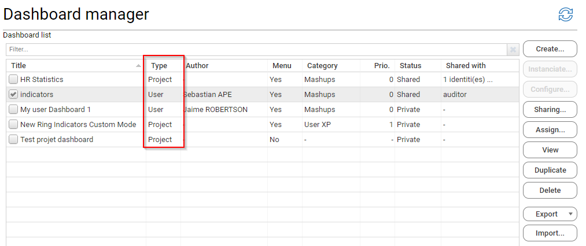

Once the project is deployed to the web portal, a technical administrator - or a developer if he has access to the target platform - must share project dashboards to the target audience.
Each time the project dashboard is modified, it will be automatically updated on the web portal and the sharing configuration will be preserved.

Dashboard designers that don't also have the developer role cannot modify project dashboards.  
This is because project dashboards can be modified in the project and will be automatically updated when the project is redeployed.  
This would cause conflicts if the projects dashboards were otherwise modified by designers on the target platform.  
If a designer would like to modify a project dashboard, he can duplicate the dashboard as a user dashboard, by un-checking the **Save to project** option in the duplicate wizard.  

Similarly, a developer can transform an existing user dashboard into a project dashboard, by duplicating the user dashboard and check the **Save to project** option in the duplicate wizard.

Note that project dashboards are excluded from the export feature.

#### Project Dashboard Lifecycle

To sum up, the typical lifecycle of the project dashboard would be the following:
first time:

- a developer creates the project dashboard on the dev environment web portal
- the project is deployed to a test environment web portal
- a technical administrator shares the project dashboard to a test audience
- project dashboard is tested
- the project is deployed to a production environment web portal
- a technical administrator shares the project dashboard to the actual target audience
- end-users can access the project dashboard
each upgrade:
- a developer modifies the project dashboard on the dev environment web portal
- the project is deployed to a test environment web portal
- project dashboard is tested
- the project is deployed to a production environment web portal
- end-users can access the modified project dashboard

#### Detailed Personae and Permissions

The table below lists the detailed authorizations for each persona:

|Persona|Permissions|
|-------|-----------|
|**Designer**|Can create ( and own), modify and delete user dashboards<br><br>Can duplicate user dashboard as another user dashboard<br><br>Can share user dashboards<br><br>Cannot create a new project dashboard nor modify an existing one|
|**Developer**|All designer permissions plus...<br><br>Can view, create, modify and delete all project dashboards (no ownership)<br><br>Can duplicate user or project dashboard to either user or project dashboard<br><br>Can optionally set default sharing parameters for any project dashboard (which can be overriden)|
|**Technical administrator**|Can list and view all project and user dashboards<br><br>Can import / export all user dashboards<br><br>Can modify sharing parameters for user and project dashboards<br><br>Can delete any dashboard<br><br>Cannot duplicate dashboards
|**End user**|Can view all project and standard dashboards shared with him<br><br>Cannot create, modify or delete dashboards|
