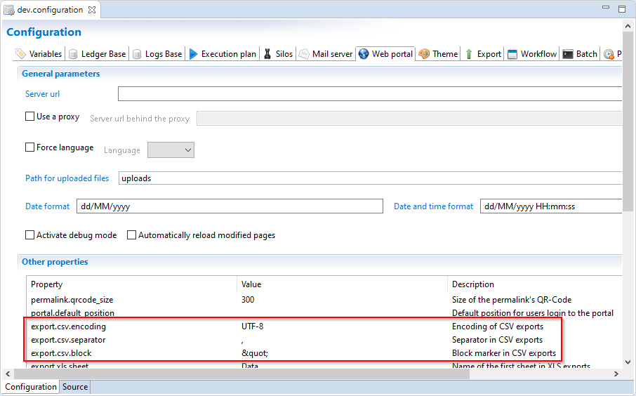

# Table of contents
{: .no_toc .text-delta }

1. TOC
{:toc}

---

During each execution plan the product will report the existing reconciliations from the previous timeslots to the new one. It will then execute the reconciliation policy **only** on accounts that are not reconciled.

This mean if there are errors in the reconciliation of certain accounts in the previous timeslots they will systematically be reported.

The causes of errors in account reconciliations are various, and include:

- Incomplete or corrupted import files
- Issues in the configuration of the reconciliation rules
- Issues in the configuration of the reconciliation policy

As of version **Ader R1 SP5**, to allow consultants to correct these types of issues and stop the report of reconciliation for certain accounts during the execution plan it is necessary to follow the steps detailed below.

# Prepare account list

It is necessary to identify the list of accounts on which it is required to stop the report of the reconciliation. This operation will only work on a given list of accounts.

---

<span style="color:grey">**NOTE:**</span> It is recommended to use rules and/or views to extract the list of accounts and export it through the `igrc_view.[cmd|sh]` command.
Note that an export directly from the view in the studio will create a UTF8-BOM file, that is not compliant.

---

Once the list of accounts is ready, a CSV file containing two mandatory columns should be created:

- The account identifier
- The repository code of the account

The format of the CSV file must correspond to the format configured in the other properties field of the web portal tab in the technical configuration.

CSV Preference are:
- export.csv.encoding
- export.csv.separator
- export.csv.block



---

<span style="color:red">**Warning:**</span> The option to break the recons also prevails over the collect. Meaning that if a noowner flag is set in the collect for an account that is also in the file, this flag will be ignored and the account will be handled by the reconpolicy.

---

# Break the postponement

This option is only available when running the execution plan trough a command line. 

The command line must include the following additional options

- `-f`: Full path to the CSV File containing list of accounts identifiers and repository codes (file prepared in first step)
- `-a`: Column name in the CSV file containing accounts identifier
- `-r`: Column name in then CSV file containing repository code

```
igrc_batch [existing IGRC batch command arguments...] -f <csv file path> -a <account identifier column name> -r <repository code column name>
```

Command example:

```
igrc_batch support C:\Applications\Ader dev -f C:\Applications\recons.csv -a identifier -r code
```


---

<span style="color:grey">**NOTE:**</span> If the CSV preference in the technical configuration are null or empty the batch command will use the following default values:

- export.csv.encoding=`UTF-8`
- export.csv.separator=`,`
- export.csv.block=`"`

---